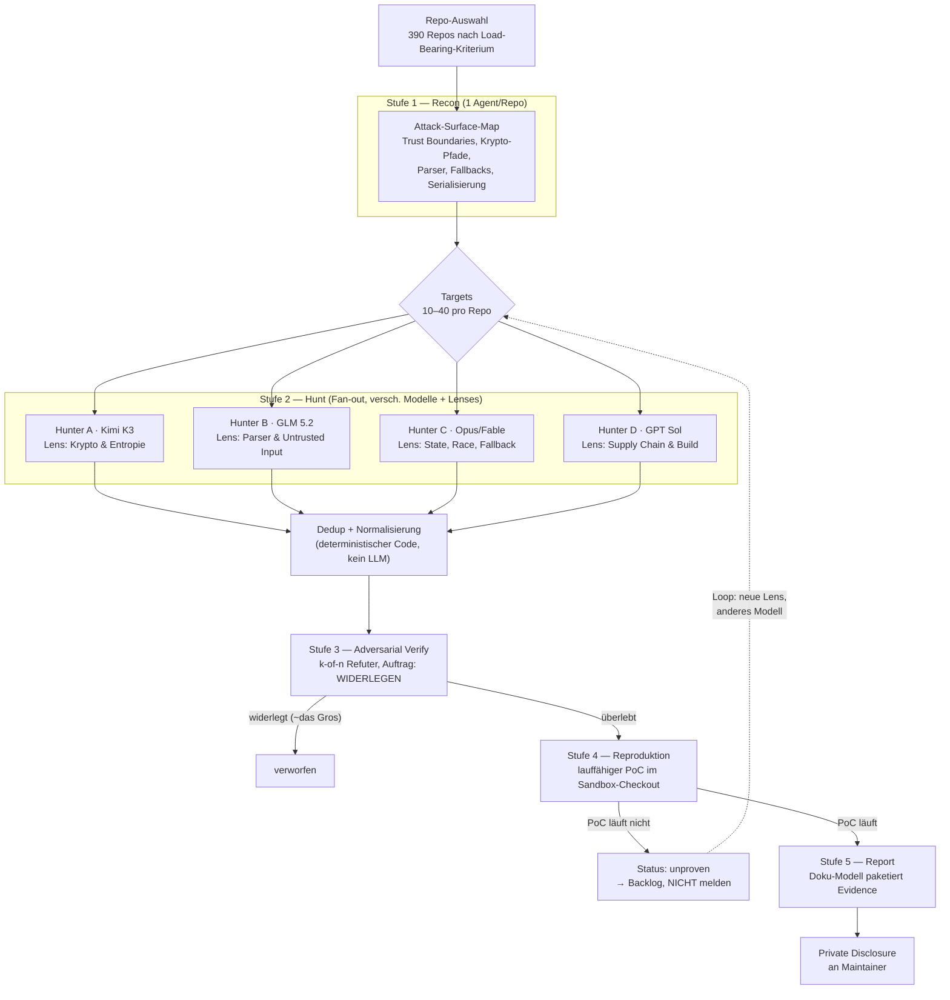

# Bitcoin Red Team — Rekonstruktion der Methodik

**Stand: 2026-08-08** · Ziel dieses Dokuments: nachvollziehen, wie das Bitcoin Red Team
in ~27,5 Stunden 4.962 Findings über 390 Repositories erzeugt hat — und daraus eine
eigene, blockierende Security-Schwelle für unsere Pull Requests ableiten.

---

## 0. Einordnung vorab (wichtig)

Drei Dinge, die man wissen muss, bevor man das nachbaut:

1. **Die Gruppe heißt "Bitcoin Red Team", nicht "RedOps".** Co-Leitung: **Calle**
   (pseudonymer Entwickler, Schöpfer des Ecash-Protokolls Cashu) und **Rob Hamilton**
   (CEO/Co-Founder AnchorWatch). 16 Freiwillige, global verteilt, 24/7.
2. **Es gibt keine öffentlichen PRs zum Nachlesen.** Das Team hat nach striktem
   *responsible disclosure* gearbeitet: kritische Findings wurden lokal reproduziert und
   dann **privat** an die Maintainer gemeldet. Es gibt (Stand heute) weder eine Website
   noch ein öffentliches GitHub-Repository der Gruppe. Eine rückwirkende Rekonstruktion
   "anhand der PRs" ist deshalb nicht möglich — die Rekonstruktion unten stützt sich auf
   die öffentlichen Situation Reports und die Berichterstattung darüber.
3. **Die Harness ist noch nicht veröffentlicht.** Angekündigt ist, sie zu open-sourcen,
   damit Firmen sie gegen eigenen Closed-Source-Code laufen lassen können. Bis dahin gilt:
   Architektur ist bekannt, Prompts sind es nicht.

Jede Aussage unten ist markiert:

| Marker | Bedeutung |
|---|---|
| **[BELEGT]** | Öffentlich vom Team kommuniziert oder in Berichterstattung zitiert |
| **[ABGELEITET]** | Folgt zwingend aus belegten Fakten (Zahlen, Tooling, Constraints) |
| **[REKONSTRUIERT]** | Unsere Nachbildung — plausibel, aber nicht die Originalprompts |

---

## 1. Auslöser: der COLDCARD-RNG-Bug

**[BELEGT]** Eine Code-Änderung von 2021 leitete die Seed-Erzeugung in der
COLDCARD-Firmware auf einen **Software-PRNG** um, der aus vorhersagbaren
geräteeindividuellen Werten initialisiert wurde, statt auf den Hardware-RNG.

Effektive Entropie laut Coinkite:

| Geräte | Effektive Entropie | Soll |
|---|---|---|
| Mk2, Mk3 | ~40 Bit | 128 Bit |
| Mk4, Mk5, Coldcard Q | ~72 Bit | 128 Bit |

Ergebnis: **über 88–100 Mio. USD** in Bitcoin abgeflossen, mindestens **15 verschiedene
Angreifergruppen**. Der Bug lag ~5 Jahre unentdeckt in einem Repository, das als eines der
am besten geprüften im Ökosystem galt.

**Die entscheidende Lehre für unser Gate:** Der Bug war *kein* Speicherfehler, *keine*
Injection, *kein* Krypto-Primitiv-Fehler. Es war ein **Fallback-Pfad, der still die
Sicherheitsgarantie senkte** — und der in Tests grün war, weil der Output weiterhin
"zufällig aussah". Klassische Linter und Unit-Tests finden so etwas strukturell nicht.
Deshalb ist die Frage, die der AI-Reviewer stellen muss, nicht "ist der Code korrekt?",
sondern **"welche Sicherheitsannahme trägt diese Zeile, und unter welchem Pfad bricht sie
lautlos?"**

---

## 2. Was das Team belegt gemacht hat

### 2.1 Kennzahlen des Sprints (4.–5. August 2026)

**[BELEGT]**

| Metrik | Wert |
|---|---|
| Dauer | 27,5 Stunden |
| Repositories | 390 |
| Findings gesamt | 4.962 |
| davon *critical* | 85 |
| davon *high* | 635 |
| Durchsatz | ~180 Findings/Stunde (Team gesamt) |
| Calle: "in der Größenordnung" | 1 kritischer Exploit / Stunde / Person |
| Anteil aus automatisiertem Scan-Intake | **91 %** |
| **Zum Zeitpunkt des Reports reproduziert** | **21,4 %** |
| Personen | 16 |
| Compute-Kosten | > 40.000 USD (Finanzierung: OpenSats) |
| Harness-Umfang (Momentaufnahme) | 171.599 Zeilen Code |

Eine frühere Momentaufnahme nennt 150 Repositories, "über ein Dutzend" private
Disclosures und ca. 20.000 USD Spend — der Sprint ist also **eskalierend** gefahren
worden, nicht als einmaliger Batch.

### 2.2 Die Zahl, auf die es ankommt

**21,4 % reproduziert.** Das Team sagt selbst explizit, dass die Findings *nicht*
pauschal als bestätigte, ausnutzbare Schwachstellen zu lesen sind.

Anders gesagt: **rund vier von fünf Findings waren zum Reportzeitpunkt unbewiesen.**
Wer diese Pipeline 1:1 als blockierendes CI-Gate nachbaut, produziert ein Gate, das in
~78 % der Fälle grundlos rot ist — und das wird nach einer Woche abgeschaltet oder
durchgewunken. **Die Reproduktionsstufe ist kein Nice-to-have, sie ist das Gate.**
(Siehe Abschnitt 5.)

### 2.3 Tooling

**[BELEGT]**

- **Gateway: OpenCode Zen** — ein Zugang, ein API-Key, pay-per-use, Zugriff auf Dutzende
  Modelle. Das war eine bewusste Design-Entscheidung: Die Harness braucht **genau einen
  Key**, damit sie extern nutzbar/verteilbar ist.
- **Modell-Arbeitsteilung:** **Kimi K3** (Moonshot AI) macht das **Scannen**; andere
  Modelle schreiben die **Begleitdokumentation/Reports** — alles über denselben Key.
- **Weitere eingesetzte Modelle:** GPT Sol, Fable, Opus, GLM 5.2. Anfangs stark auf
  chinesische Open-Weight-Modelle gestützt, später kam Zugang zu OpenAI- und
  Anthropic-Modellen dazu.
- **Basis:** ein Agent-Harness im Stil von OpenCode (der Open-Source-Coding-Agent), stark
  erweitert; "mehrere Harnesses", nicht eine.
- **Parallelität:** "Dutzende laufender Agents/Subagents".

**[ABGELEITET] — Die Abrechnungsform ist kein Teil der Methode.** Das Ein-Key-Design war eine
*Verteilbarkeits*-Entscheidung (die Harness sollte extern lauffähig sein), keine technische
Notwendigkeit. Dieselben Modelle — Kimi K3 eingeschlossen — sind über Abo-CLIs im Terminal
erreichbar (`kimi -p` auf einer Kimi-Membership, `claude -p` auf einem Claude-Abo), ohne
Token-Abrechnung. Für einen Einmal-Sprint über 390 Repos war metered richtig; für ein Gate,
das bei *jedem* PR läuft, ist es die falsche Kostenkurve. Unsere Harness behandelt Provider
deshalb als austauschbar und nutzt standardmäßig den Abo-Weg. Die Gegenrechnung: Abos deckeln
die Parallelität (Kimi Code: ~30 gleichzeitige Requests, 300–1.200 pro 5-h-Fenster) — der
Fan-out, der den Sprint schnell gemacht hat, ist damit nicht beliebig skalierbar.

### 2.4 Prozess-Stufen der Harness

**[BELEGT]** — vom Team so beschrieben:

1. **Identifizieren** kritischer Bitcoin-Libraries und *high-load-bearing code*
2. **Finden und dokumentieren** von Schwachstellen
3. **Reproduzieren** der Schwachstelle (lokal)
4. **Paketieren** der belegten Daten in verwertbare Reports
5. **Responsible Disclosure** an die Maintainer (privat, vor jeder Veröffentlichung)

### 2.5 Die kontraintuitive Kultur-Entscheidung

**[BELEGT]** Zwei Zitate, die die Architektur mehr erklären als alles andere:

> Vieles ist weiterhin manuell — "hand holding the AI" — während die automatisierten
> Harnesses parallel besser werden.

> Jeden seine eigene bevorzugte Review-Methode nutzen zu lassen, hat sich als die
> effektivste Strategie erwiesen — weil unterschiedliche Leute ihre Agents unterschiedlich
> prompten und dadurch **unterschiedliche Bugs** finden.

**[ABGELEITET]** Das Team hat also bewusst **nicht** auf einen Standard-Prompt
vereinheitlicht. Prompt-Diversität war die *Suchstrategie*, nicht ein Übergangszustand.
Das ist der Grund, warum es keinen "den einen Prompt" gibt, den man kopieren könnte — und
gleichzeitig der wichtigste nachbaubare Mechanismus: **N Hunter mit verschiedenen Modellen
und verschiedenen Blickwinkeln auf dasselbe Ziel schlagen 1 Hunter mit N Durchläufen.**

---

## 3. Rekonstruierter Agent-Graph

**[REKONSTRUIERT]** — konsistent mit allen Zahlen aus 2.1 (91 % Auto-Intake, 21,4 %
reproduziert, Modell-Arbeitsteilung, Dutzende Subagents, 5 Prozess-Stufen).

**Der Knackpunkt sind die zwei Filterstufen `E` und `F`.** Die 4.962 Findings sind der
Output *vor* `F`. Die 21,4 % sind der Output *nach* `F`. Wer nur `A→B→C→HUNT` nachbaut,
bekommt die 4.962 — und nicht die 85.

---

## 4. Rekonstruierte Prompts

**[REKONSTRUIERT]** — die Originale sind nicht veröffentlicht. Diese Prompts sind aus den
belegten Stufen und Constraints abgeleitet und liegen ausführbar unter
[`security/redteam/prompts/`](../../security/redteam/prompts/). Hier die Logik dahinter:

### 4.1 Recon (`01-recon.md`)

Zweck: *load-bearing code* finden, nicht Code lesen. Die Leitfrage ist nicht "wo ist ein
Bug", sondern **"was passiert im schlimmsten Fall, wenn diese Datei lügt?"**
Output ist eine priorisierte Zielliste mit `blast_radius` — nur so bekommt man aus einem
Repo mit 200k Zeilen die 20 Dateien, auf die sich der teure Teil lohnt.

### 4.2 Hunt (`02-hunt.md`)

Ein Hunter pro *Lens*, nicht pro Datei. Die Lenses bilden die Bug-Klassen ab, die im
Bitcoin-Kontext tatsächlich Geld kosten:

| Lens | Frage |
|---|---|
| **Entropie & Krypto** | Woher kommt Zufall? Gibt es einen Fallback-Pfad, der leiser ist als der Hauptpfad? Wird Entropie nachträglich verkürzt, gemodded, geseedet? *(= der COLDCARD-Fall)* |
| **Parser & Untrusted Input** | Was passiert bei fehlerhaftem/bösartigem Input aus dem Netz, aus einer PSBT, aus einer QR/URI, aus einer Datei? |
| **State & Race** | Kann ein Zustandsübergang doppelt/verschränkt/rückwärts laufen? Signieren zweimal mit demselben Nonce? |
| **Fallback & Degradation** | Wo senkt der Code still eine Garantie, statt zu scheitern? *(die gefährlichste Klasse — Tests bleiben grün)* |
| **Supply Chain & Build** | Postinstall-Skripte, gepinnte vs. floating Deps, CI mit Schreibrechten, Secrets in Logs |

Harte Regel im Prompt: **jedes Finding braucht Datei, Zeile, konkreten Angreiferpfad und
eine Aussage darüber, was der Angreifer am Ende in der Hand hat.** Ohne das ist es kein
Finding, sondern eine Code-Review-Meinung.

### 4.3 Verify (`03-verify.md`)

Der Prompt, der den Unterschied macht. Der Verifier bekommt **den Auftrag zu widerlegen**,
nicht zu bewerten — inklusive Default: *im Zweifel widerlegt*. k-of-n (z. B. 2 von 3
Refutern müssen scheitern, damit das Finding überlebt). Verschiedene Modelle als Refuter,
sonst bestätigt sich ein Modell seine eigene Halluzination.

### 4.4 Repro (`04-repro.md`)

Kein Prosa-Beweis. Ein **ausführbares Skript**, das im Checkout läuft und mit Exit-Code 0
endet, *wenn der Bug da ist*. Läuft es nicht → Status `unproven` → geht **nicht** raus.
Das ist die Stufe, die 4.962 auf 21,4 % eindampft.

### 4.5 Report (`05-report.md`)

Separates Modell (belegt: "andere Modelle schreiben die Doku"). Grund: Das Modell, das den
Bug gefunden hat, schreibt den Report tendenziell überzeugend statt korrekt. Das Doku-Modell
sieht nur *Finding + PoC-Output* und darf nichts hinzuerfinden.

---

## 5. Übertragung auf unser PR-Gate

Die Red-Team-Pipeline ist eine **Such**maschine: viel Fan-out, teuer, akzeptiert
Falsch-Positive. Ein PR-Gate ist das Gegenteil: **eng, billig, und darf praktisch nie
grundlos rot sein**, sonst wird es umgangen.

Die Umkehrung sieht so aus:

| | Red-Team-Sprint | Unser PR-Gate |
|---|---|---|
| Scope | ganzes Repo | **nur das Diff** + direkte Aufrufer |
| Fan-out | Dutzende Agents | 2–4 Lenses, nur die relevanten |
| Falsch-Positive | akzeptiert (Mensch triagiert) | **blockieren nur nach Verify** |
| Laufzeit | Stunden | < 5 Minuten |
| Blockierend | nein | **ja, ab confirmed high** |

Umgesetzt in zwei Stufen — Details und Konfiguration in
[`security/README.md`](../../security/README.md):

**Stufe A — deterministisch, immer, ohne AI** (`security/gate/static-checks.sh`)
Läuft in Sekunden, kostet nichts, ist nicht bestechlich: Secret-Muster, neue
Postinstall-Skripte, Änderungen an Workflow-Dateien, Lockfile-Änderungen ohne
Manifest-Änderung, `eval`/`child_process`/`curl | sh`. Das fängt die Klasse
"böser PR von außen" ab und blockiert hart.

**Stufe B — AI-Review auf dem Diff** (`security/redteam/harness.mjs`)
Hunt → Verify → Report auf den geänderten Zeilen. Blockiert **nur** bei Findings, die die
Verify-Stufe überlebt haben und `high`/`critical` sind. Alles andere wird als Kommentar
gepostet, nicht als Blocker. Ohne API-Key wird Stufe B übersprungen — Stufe A blockiert
trotzdem.

Verdrahtet als Required Check in
[`.github/workflows/security-scan.yml`](../../.github/workflows/security-scan.yml).

---

## 6. Was wir bewusst *nicht* nachbauen

- **Die 91 % Auto-Intake ohne Menschen dahinter.** Das Red Team hatte 16 Leute für die
  Triage. Wir haben das nicht — deshalb liegt bei uns die Schwelle hinter der
  Verify-Stufe, nicht davor.
- **Modell-Monokultur.** Ein einziges Modell in allen Stufen bestätigt sich selbst. Wenn
  nur ein Anbieter verfügbar ist: mindestens verschiedene *Lenses* und einen
  Refuter-Durchlauf mit anderem Temperature/System-Prompt.
- **Automatisches Melden.** Nichts verlässt das Gate Richtung Upstream ohne Menschen.
  Responsible Disclosure war der Teil, den das Red Team am strengsten gefahren hat, und der
  Teil, bei dem Automatisierung am meisten Schaden anrichtet.

---

## 7. Quellen

Primär (Team-Kommunikation):
- Calle (@callebtc), "red teaming bitcoin" — <https://x.com/callebtc/status/2084561246305542617>
- Calle (@callebtc), Red-Team-Update / SITREP — <https://x.com/callebtc/status/2085024458012586286>
- Rob Hamilton (@Rob1Ham), Red Team Update — <https://x.com/Rob1Ham/status/2084927733725839503>

Berichterstattung mit Methodik-Details:
- [Bitcoin Magazine — 4,962 Vulnerabilities In 27.5 Hours](https://bitcoinmagazine.com/business/bitcoin-red-team-finds-85-critical-flaws-across-390-open-source-repos-after-coldcard-exploit)
- [Open Source For You — Bitcoin Red Team To Open Source AI Security Harness](https://www.opensourceforu.com/2026/08/bitcoin-red-team-to-open-source-ai-security-harness-after-major-audit/) *(OpenCode Zen, Modell-Arbeitsteilung)*
- [FairGambling Newsroom — Disclosures Across 150 Repos](https://www.fairgambling.com/news/bitcoin-red-team-150-repos-dozen-disclosures) *(Ein-Key-Design, Kimi K3 scannt)*
- [Cryptobriefing — 4,962 findings in 27.5 hours](https://cryptobriefing.com/bitcoin-red-team-audit-findings/)
- [Decrypt — Bitcoin AI Security Audit Files 4,962 Findings](https://decrypt.co/375029/bitcoin-ai-security-audit-files-4962-findings-across-390-projects)
- [Cointelegraph — Bitcoin Red Team Reports 5K Findings](https://cointelegraph.com/news/bitcoin-red-team-reports-5k-findings-in-sweeping-security-audit)
- [TFTC — 85 Critical Flaws Across 390 Repos](https://www.tftc.io/bitcoin-red-team-85-critical-flaws-390-repos-coldcard)
- [crypto.news — 4,962 issues after Coldcard exploit](https://crypto.news/bitcoin-red-team-finds-4962-issues-reviewing-bitcoin-projects-after-coldcard-exploit/)
- [CoinDesk — "a critical bug every hour"](https://www.coindesk.com/tech/2026/08/06/bitcoin-developers-flag-85-critical-bugs-in-an-extremely-bad-situation)

Auslöser (technische Primäranalyse):
- [Block Engineering — Predictable RNG Fallback and 32-Bit Reseed in COLDCARD Firmware](https://engineering.block.xyz/blog/predictable-rng-fallback-and-32-bit-reseed-in-coldcard-firmware)
- [Bitcoin Optech Newsletter #416](https://bitcoinops.org/en/newsletters/2026/07/31/)
