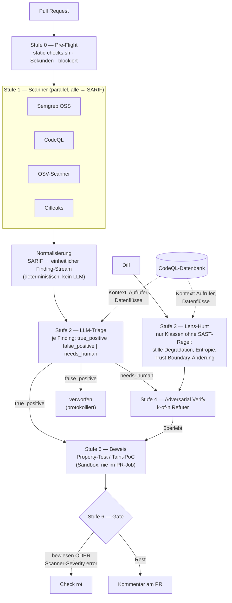

# Implementierungsplan: Security-Scan

**Stand: 2026-08-08** · Ausführbarer Plan für den Umbau von `security/` auf die Architektur
aus [`setup-evaluation.md`](./setup-evaluation.md).

Leitprinzip, aus der Evidenz: **Werkzeuge suchen, das Modell filtert.** Die LLM-Stufe wandert
vom Anfang der Pipeline ans Ende.

---

## 0. Entschieden

**Zielbild (A): generische Vorlage** für Systeme mit echtem Anwendungscode — JS/TS-Services,
Wallet-Logik, alles mit Parsern, Krypto und Untrusted Input.

Das Repository trägt ausschließlich das Gate. Damit entfällt **Phase 1b**
(Asset-Integrität: Adress-Kollision, Symbol-Squatting, Logo-Hashing) — sie war nur für
Zielbild (B) gedacht und wird hier nicht weiterverfolgt.

**Das Repository ist öffentlich.** Damit ist **CodeQL kostenlos** nutzbar, und die
Rückfallebene „Semgrep mit erweitertem Regelsatz statt CodeQL" aus §2 entfällt.

---

## 1. Zielarchitektur



**Die zentrale Vereinfachung:** Die CodeQL-Datenbank aus Stufe 1 dient gleichzeitig als
Graph-Layer für Stufe 2 und 3. Der Build ist ohnehin bezahlt — damit brauchen wir zunächst
kein separates Joern/Codebadger. Das spart eine komplette Komponente.

---

## 2. Werkzeugwahl und Begründung

| Tool | Rolle | Laufzeit | Blockiert bei | Kosten |
|---|---|---|---|---|
| **Semgrep OSS** | Breitenscan, eigene Regeln, deckt auch YAML/Actions ab | ~30 s | `ERROR` | 0 |
| **CodeQL** | Interprozedurale Taint-Analyse JS/TS | 3–8 min | `error`-Severity | 0 bei public repo, sonst GHAS |
| **OSV-Scanner** | Abhängigkeiten, lockfile-genau | ~15 s | bekannt ausgenutzt / critical | 0 |
| **Gitleaks** | Secrets im Diff und in der History | ~10 s | jeder Treffer | 0 |
| **Lens-Harness** | Klassen ohne SAST-Regel | 2–5 min | nach Verify, high/critical | Abo |

**Geklärt:** Das Repository ist öffentlich, CodeQL ist damit kostenlos. Kein GHAS nötig,
keine Rückfallebene erforderlich.

**Warum nicht Snyk/Sonar:** kostenpflichtig, und ihr Mehrwert liegt in Reporting und
Governance, nicht in der Erkennung. Für ein Gate zählt der Scanner-Kern.

---

## 3. Phasen

### Phase 0 — Messgrundlage (**zuerst**, ohne sie ist alles Weitere unbelegt)

*Aufwand: 1–2 Tage. Ohne diese Phase lässt sich später nicht sagen, ob der Umbau geholfen hat.*

1. **Bug-Korpus bauen** — `security/eval/corpus/`
   - 15–20 echte, gefixte Schwachstellen als Diffs. Quellen: historische CVEs in
     JS/TS-Wallet- und Krypto-Libs, GitHub Security Advisories, `SEC-bench`-Instanzen.
   - 5–8 **selbst gebaute** im COLDCARD-Muster: stiller Fallback auf schwächere Entropie,
     übersprungene Verifikation bei fehlendem Key, still gekürzter Nonce. Diese Klasse fehlt
     in allen öffentlichen Korpora, und sie ist die teuerste.
   - 20–30 **harmlose** PRs aus der Repo-History als Negativkontrolle.
2. **Runner** — `security/eval/run.mjs`: fährt jeden Korpus-Eintrag durch die Pipeline,
   schreibt eine Matrix.
3. **Baseline messen** mit der *aktuellen* Harness.

**Metriken** (alle vier, sonst ist es keine Messung):

| Metrik | Definition | Zielwert vor „required" |
|---|---|---|
| Detection Rate | erkannte / bekannte Bugs | ≥ 50 % |
| **Falsch-Positiv-Rate** | Blocker auf harmlosen PRs | **≤ 5 %** |
| Kosten / PR | Tokens bzw. Abo-Requests | dokumentiert |
| Wall-Clock p95 | bis Check grün | ≤ 8 min |

Die FP-Rate ist das Abnahmekriterium, nicht die Detection Rate. Ein Gate mit 80 % Detection
und 30 % FP wird nach zwei Wochen durchgewunken und ist dann wertlos.

---

### Phase 1 — Scanner + SARIF-Normalisierung

*Aufwand: 2–3 Tage. Höchster belegter Nutzen, geringstes Risiko.*

**Warum SARIF:** GitHub Code Scanning nimmt es nativ entgegen, jedes Tool spricht es, und die
Triage-Stufe bekommt einen einzigen Eingabetyp statt vier Parsern.

Neue Dateien:

```
security/
├── scanners/
│   ├── semgrep/rules/            eigene Regeln (siehe unten)
│   ├── run-scanners.sh           orchestriert alle vier, sammelt SARIF
│   └── normalize.mjs             SARIF → findings.json (einheitliches Schema)
└── eval/                         aus Phase 0
```

**Eigene Semgrep-Regeln** (`security/scanners/semgrep/rules/`) — der Teil, den kein
Standard-Regelsatz liefert:

- `workflow-injection.yaml` — `${{ github.event.* }}` in `run:`-Blöcken
- `pull-request-target.yaml` — `pull_request_target` mit Checkout des PR-Heads
- `install-hook.yaml` — neu hinzugefügte `preinstall`/`postinstall`-Skripte
- `weak-random.yaml` — `Math.random()` in Pfaden mit `key`, `seed`, `nonce`, `token`, `salt`
- `silent-catch.yaml` — `catch` ohne Rethrow/Log um Krypto- oder Verifikationsaufrufe

Die letzten beiden sind der Versuch, die COLDCARD-Klasse wenigstens teilweise statisch zu
fassen. Sie werden unvollständig sein — dafür gibt es Stufe 3.

**Ablösung:** `static-checks.sh` gibt Secrets an Gitleaks und Lockfile-Prüfung an
OSV-Scanner ab. Es behält nur, was kein Tool abdeckt: CI-Änderungen als Review-Pflicht.

**Abnahme:** Alle vier Scanner laufen in CI, erzeugen gültiges SARIF, Ergebnisse erscheinen
im GitHub-Security-Tab. Korpus-Durchlauf zeigt Detection Rate **und** FP-Rate der reinen
Tool-Stufe. Erwartung laut Literatur: gute Detection, **FP-Rate deutlich über 50 %** — genau
deshalb folgt Phase 2.

---

### Phase 2 — LLM-Triage auf SARIF

*Aufwand: 2 Tage. Der Schritt mit der belegtesten Wirkung.*

Neu: `security/redteam/prompts/06-triage.md`, `security/redteam/triage.mjs`.

Pro Finding aus Stufe 1:
- **Eingabe:** SARIF-Result, betroffene Codestelle, umschließende Funktion, **Aufrufer aus
  der CodeQL-Datenbank**, plus die Taint-Path-Schritte, falls CodeQL welche liefert.
- **Ausgabe:** `true_positive | false_positive | needs_human` mit Begründung und `file:line`.
- **Modell:** das stärkste verfügbare. Agentische Triage bringt bei schwachen Backbones
  nachweislich wenig.
- **Default:** `needs_human`. Ein Modell, das im Zweifel `false_positive` sagt, baut lautlos
  eine Lücke ins Gate.

**Zielwerte** (Literatur: OWASP-Benchmark 92 % → 6 % FP; CodeQL-FP-Erkennung 93,3 %):
FP-Rate nach Triage **≤ 10 %**, und **kein einziger** Korpus-Bug darf als `false_positive`
verworfen werden. Zweites Kriterium schlägt erstes.

**Protokollpflicht:** Jedes verworfene Finding wird mit Begründung in das Artefakt
geschrieben. Ein Filter, dessen Entscheidungen niemand nachlesen kann, ist nicht auditierbar.

---

### Phase 3 — Lens-Kanal einhängen

*Aufwand: 1 Tag (die Harness existiert).*

`harness.mjs` wird vom Haupt- zum Nebenkanal:
- Lenses reduziert auf **`fallback`, `entropy`, `state`** — genau die Klassen ohne
  SAST-Regel. `parser` und `supply-chain` übernehmen Semgrep und OSV besser.
- Kontext erweitert: nicht nur das Diff, sondern die Aufrufer aus der CodeQL-DB.
- Output fließt in dieselbe Verify-Stufe wie `needs_human` aus Phase 2.

---

### Phase 4 — Beweisstufe

*Aufwand: 3–4 Tage. Die derzeit fehlende Stufe.*

`security/redteam/prove.mjs` plus `prompts/04-repro.md` (existiert).

Zwei Beweisarten für JS/TS:
1. **Property-Test** (`fast-check`) — für Parser, Wert-Arithmetik, Serialisierung. Das Modell
   formuliert die verletzte Invariante, `fast-check` sucht das Gegenbeispiel.
2. **Taint-PoC** — wenn CodeQL einen Pfad Quelle→Senke liefert, erzeugt das Modell einen
   Test, der genau diesen Pfad durchläuft.

**Ausführung ausschließlich in einer Sandbox:** eigener Job, ohne Repo-Token, ohne Netz,
Container mit read-only Mount. Modellgenerierten Code im PR-Job auszuführen bleibt
ausgeschlossen — siehe `security/README.md`.

Für PRs aus Forks läuft Phase 4 gar nicht; dort endet das Gate nach Stufe 4 mit
„verifiziert, nicht bewiesen".

---

### Phase 5 — Graph-Kontext ausbauen *(optional)*

*Aufwand: 2–3 Tage. Erst starten, wenn Phase 2 misst, dass fehlender Kontext die
Hauptfehlerquelle ist.*

Wenn die CodeQL-DB als Kontextquelle nicht reicht: **Codebadger** als MCP-Server (Joern-CPG:
Program Slicing, Taint Tracking, semantische Navigation). Belegter Nutzen: CPG-Slices
reduzieren die Codemenge um 67,8–90,9 % bei erhaltenem schwachstellenrelevanten Kontext.

---

### Phase 6 — Hooks, drei Ebenen

*Aufwand: 1–2 Tage.*

| Ebene | Datei | Was | Laufzeit |
|---|---|---|---|
| Agent | `.claude/settings.json` — `PreToolUse` auf `Edit`/`Write` | Semgrep auf die berührte Datei | ms |
| Commit | `.pre-commit-config.yaml` (husky) | Semgrep + Gitleaks auf den gestagten Diff | Sekunden |
| CI | `.github/workflows/security-scan.yml` | volle Pipeline | Minuten |

`PreToolUse` ist der einzige Hook, der blockieren kann. Optional zusätzlich der
Commit-Gate-Pattern: `PreToolUse` auf `git commit`, der bis zu einem `Verdict: CLEAN`
blockiert, das an genau dieses Diff gebunden ist.

---

### Phase 7 — Scharfschalten

*Aufwand: 1 Tag + 2–4 Wochen Beobachtung.*

1. Alle Stufen laufen, blockieren aber noch nicht (nur Kommentar).
2. Zwei bis vier Wochen echte PRs beobachten, FP-Rate messen.
3. **`Security Scan / static` und `Security Scan / scanners` als required** setzen.
4. `ai-review` erst danach, und nur wenn die gemessene FP-Rate ≤ 5 % ist.

---

## 4. Reihenfolge und Aufwand

| Phase | Aufwand | Nutzen | Abhängig von |
|---|---|---|---|
| 0 Messgrundlage | 1–2 d | ohne sie ist nichts belegbar | — |
| 1 Scanner + SARIF | 2–3 d | **hoch** | 0 |
| 2 LLM-Triage | 2 d | **hoch** | 1 |
| 3 Lens-Kanal | 1 d | mittel | 2 |
| 4 Beweisstufe | 3–4 d | hoch | 3 |
| 5 Graph-Kontext | 2–3 d | offen | 2 (Messung) |
| 6 Hooks | 1–2 d | mittel | 1 |
| 7 Scharfschalten | 1 d + 2–4 Wo | — | alle |

**Summe: ~2 Wochen Arbeit** plus Beobachtungszeit. Phase 0 ist erledigt, Baseline gemessen —
siehe [Messungen](./measurements.md).

Wenn nur ein Tag zur Verfügung steht: **Phase 1**. Semgrep und OSV-Scanner in CI, nicht
blockierend, Ergebnisse im Security-Tab. Das ist der größte Einzelsprung und unabhängig von
allem anderen.

---

## 5. Kostenschätzung

| Posten | Annahme | Kosten |
|---|---|---|
| Semgrep, OSV, Gitleaks | Open Source, GitHub-Runner | 0 |
| CodeQL | öffentliches Repo | 0 (privat: GHAS) |
| LLM-Triage | ~5–20 Findings/PR, starkes Modell | Abo-Requests, kein Token-Preis |
| Lens-Hunt | 3 Lenses × 1 Call | Abo-Requests |
| Verify | k-of-n, nur auf `needs_human` | Abo-Requests |

Bei ~30 PRs/Woche bleibt das im Rahmen eines Kimi- plus eines Claude-Abos. Zum Vergleich:
Buttercup erreichte 90 % Genauigkeit bei 181 USD/Punkt — mit Nicht-Reasoning-Modellen.

---

## 6. Risiken

| Risiko | Gegenmaßnahme |
|---|---|
| **Alarmmüdigkeit** — Gate wird durchgewunken | FP-Rate ≤ 5 % ist Abnahmekriterium; Phase 7 blockiert erst nach Messung |
| **Triage verwirft echten Bug** | Default `needs_human`; Korpus-Kriterium „kein Bug darf verworfen werden" |
| **CodeQL kostet bei privatem Repo** | Vorab klären; Fallback erweiterte Semgrep-Regeln |
| **Modellgenerierter Code in CI** | Beweisstufe nur in Sandbox ohne Token und Netz; bei Fork-PRs gar nicht |
| **CLI-Agent mit Tool-Zugriff auf Fork-Code** | Fork-PRs nutzen HTTP-Provider, nicht `cli` |
| **Laufzeit reißt Entwickler aus dem Fluss** | Semgrep blockiert früh und schnell; CodeQL und LLM-Stufen laufen parallel nach |
| **Plan misst sich nie selbst** | Phase 0 zuerst, nicht zuletzt |

---

## 7. Definition of Done

- [ ] Korpus mit ≥ 20 bekannten Bugs und ≥ 20 harmlosen PRs, Runner reproduzierbar
- [ ] Vier Scanner in CI, SARIF im Security-Tab
- [ ] Triage-Stufe: FP-Rate ≤ 10 %, kein Korpus-Bug verworfen
- [ ] Beweisstufe läuft in Sandbox ohne Token und Netz
- [ ] Drei Hook-Ebenen aktiv
- [ ] Gemessene Zahlen dokumentiert in `docs/security/measurements.md`
- [ ] `Security Scan / static` und `/ scanners` als required gesetzt
- [ ] Runbook: was tun, wenn das Gate rot ist

---

## 8. Was dieser Plan nicht liefert

Zuverlässige Vollabdeckung. Das beste gemessene System der Welt (ATLANTIS) fand 61 % der
Schwachstellen — in einem Wettbewerb mit maschinell überprüfbarer Ground Truth, die es in
JS/TS nicht gibt. Realistisches Ziel ist ein Gate, das die *bekannten* Klassen zuverlässig
blockiert, den Rest gefiltert einem Menschen vorlegt, und dessen Fehlerrate gemessen und
dokumentiert ist.
